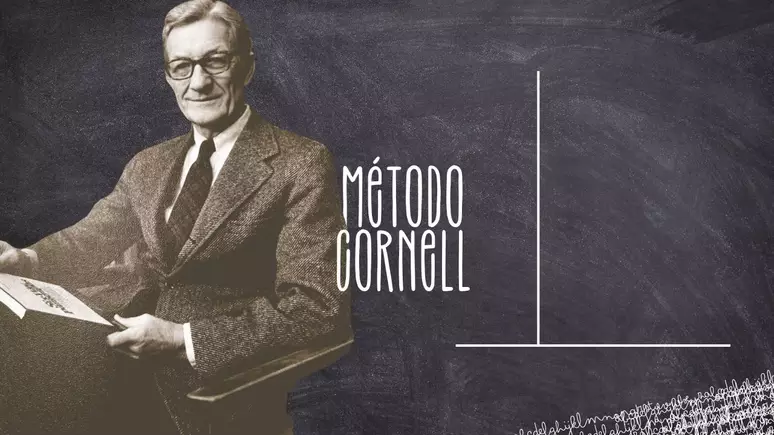

# Curso de estatistica Básica Descritiva
## Introdução

# O método de anotação para quem quer aprender de verdade 
# Decoreba nunca mais! Método criado por professor da Universidade Cornell ensina a resumir do jeito certo

Muita gente passa os anos da escola e até da faculdade só decorando o conteúdo para ir bem nas provas e sente que nunca aprende de verdade. O Método Cornell, criado pelo professor Walter Pauk - que não por acaso lecionou na Universidade Cornell, nos Estados Unidos - promete acabar com a decoreba ensinando a fazer anotações de um jeito mais inteligente. A técnica se popularizou com o lançamento do livro escrito pelo professor, "How To Study In College" [Como estudar na faculdade], em 1962.

A versão e-book do livro está disponível apenas em inglês na Amazon, mas neste texto você aprende como executar o método, passo a passo. Ele foi criado para ser colocado em prática dentro da sala de aula, com o próprio caderno do aluno. Tudo que você precisa é papel, caneta e uma régua se quiser um traço bem retinho - marcadores coloridos são opcionais.

+ O cientista que inventou uma técnica para aprender qualquer coisa

Como usar o Método Cornell
Você vai dividir a folha do caderno em três seções:

Tópicos mais importantes da aula
Anotações gerais
Resumo
Mas não basta fazer três linhas horizontais! Calma que a gente explica - e até desenha no fim para ficar mais fácil entender.

A primeira seção é a menor, podendo ter a largura de uma régua. É só traçar uma linha na vertical, no canto esquerdo da folha. Nela você vai destacar os tópicos principais da matéria estudada quando a aula terminar.

A segunda seção é a que ocupa maior espaço na folha, e deve ser usada durante a aula. Nela você fará suas anotações de maneira sucinta e em poucas linhas.

A terceira seção fica no rodapé da página, e é o resumo. Ele tem que ser feito após a aula e depois que o estudante elencar os tópicos principais estudados na primeira sessão. Ou seja, é a última parte que será preenchida na folha. No resumo é onde você explica, com as suas palavras, o que viu, ouviu e absorveu.

Veja um exemplo usando a Revolução Chinesa abaixo.

[alt text](1669847868-exemplo-metodo-cornell.webp)

Exemplo de resumo da Revolução Chinesa feito com o Método Cornell
Foto: Guia do Estudante/Canva/Reprodução / Guia do Estudante
+ Escrever à mão nos torna mais inteligentes

Por que fazer anotações e resumos?
É comprovado cientificamente que fazer resumos e anotações ajuda a absorver melhor o conteúdo - e se eles forem feitos à mão, em um papel, melhor ainda! Um estudo realizado por pesquisadores das Universidades de Princeton e da Califórnia, ambas dos Estados Unidos, analisou um grupo de estudantes onde uma parte fazia anotações por computador, e outra parte fazia no papel. O segundo grupo conseguia absorver melhor o conteúdo ao escrever com suas palavras o que era estudado, enquanto o primeiro apenas digitava o que o professor falava na sala de aula.

É importante frisar que um resumo não é uma cópia do texto visto na aula, e sim uma seleção das informações mais importantes abordadas nela.

## Fonte:
https://www.terra.com.br/noticias/educacao/o-metodo-de-anotacao-para-quem-quer-aprender-de-verdade,cc6bfe848ac8eac32676764c03a3d7b0emvrfwhg.html